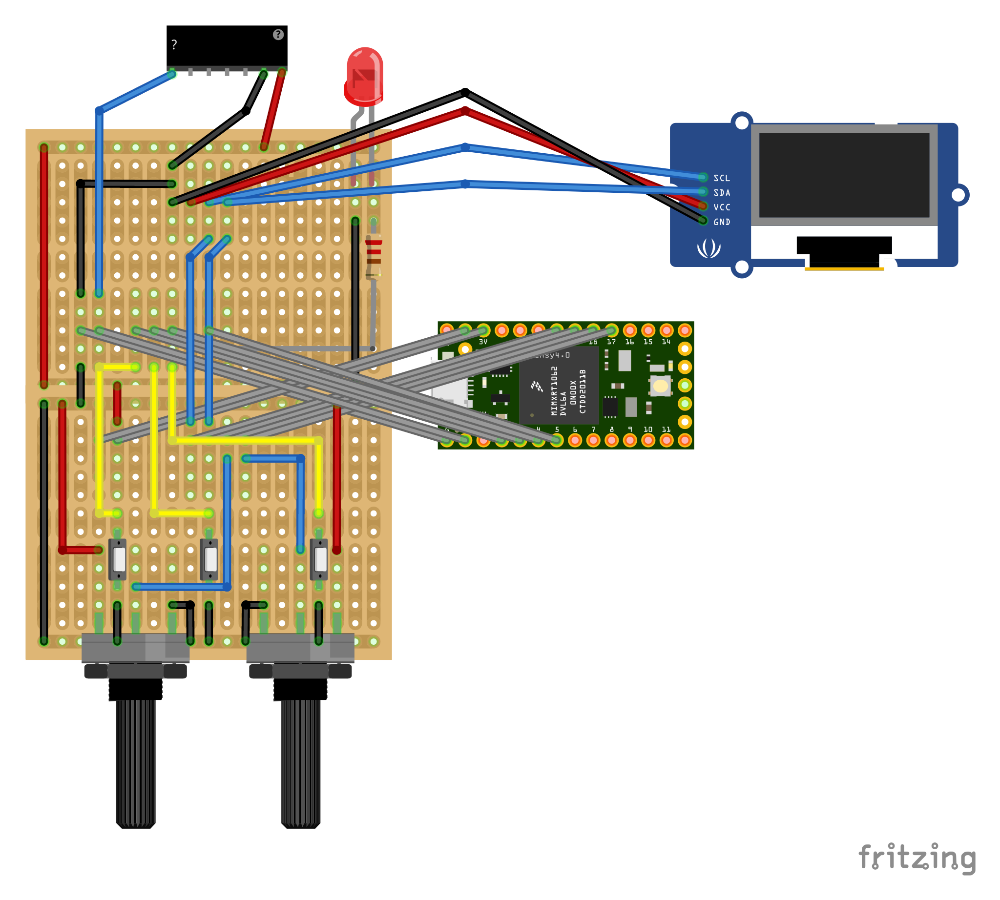

# MultiSynth

## An open-source, Arduino-based wavetable synthesizer
MultiSynth aimed to create an open-source wavetable synthesizer that would be accessible to musicians and audio engineers of all skill levels, using inexpensive microcontrollers to store and process audio information. It requires an input MIDI device, or a MIDI emulator attached to a PC. MultiSynth was released under an open-source license, which means that anyone can download the source code and make modifications to it.

## Wavetable synthesis, explained
Wavetable synthesis utilizes a set of pre-recorded waveforms, or "wavetables," as the basis for its sound generation. These wavetables can be created from any sound source, such as recordings of acoustic instruments or nature sounds, or they can be generated by the synthesizer itself. The wavetables are stored in the synthesizer's memory and can be selected and manipulated in real-time by the user to create a wide range of sounds. One of the key features of wavetable synthesis is that it allows for very precise control over the harmonic content of a sound. Each wavetable contains a unique set of harmonics, and by blending between different wavetables, or by applying various modulation techniques, the user can create sounds that are not possible with other synthesis methods. This makes wavetable synthesis particularly well-suited for creating complex and evolving sounds, such as pads, leads, and soundscapes.

Wavetable synthesis is often compared to other types of synthesis such as FM, subtractive and additive synthesis. However, the main difference is that wavetable synthesis uses pre-recorded waveforms as its sound source, whereas the other methods use mathematical algorithms to generate the sound. Additionally, wavetable synthesis often allows for more precise control over the harmonic content of a sound, and it is well-suited for creating complex and evolving sounds.

## Powered by Teensy Arduino
The Teensy Arduino is a microcontroller board that is based on the Arduino platform and is specifically designed for audio applications. It utilizes a 32-bit Cortex-M4 processor, which allows for high-quality audio processing and a wide range of capabilities such as audio synthesis, effects processing, and sample playback. The Teensy Arduino also has a built-in audio library, which makes it easy for users to access and manipulate audio data, and it also has a variety of input and output options, such as analog and digital inputs and outputs, and USB audio support. The board is small and low power consumption which makes it ideal for portable audio devices. In addition to that, it offers a large community and a wealth of resources such as tutorials and example codes, making it accessible for both experienced and beginner audio developers.

## Embraces MIDI protocols
MIDI (Musical Instrument Digital Interface) is a protocol that allows electronic musical instruments and computers to communicate with each other. It works by sending and receiving messages, known as MIDI data, that contain information about musical events such as note on/off, pitch bend, and control changes. These messages are sent over a MIDI cable or a MIDI interface to another device that can interpret the data and use it to control sound or other parameters.

MIDI data is organized into three main types of messages: note messages, control messages, and system messages. Note messages, also known as "note on" and "note off" messages, contain information about which note is being played and when it starts and stops playing. Control messages, such as pitch bend and modulation, contain information about how the sound is being shaped in real-time. System messages, such as "clock" and "active sensing," are used for synchronization and communication between devices. MIDI has been widely adopted in the music industry and it's used in a variety of applications such as music production, live performances and education. 

## Resources
- [Teensy Guide](https://teensyaudio.github.io/Wavetable-Synthesis)
- [Fritzing](http://fritzing.org/)
- [Arduino](https://www.arduino.cc)